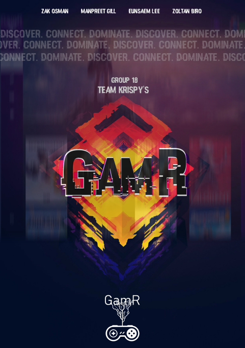

# GamR

# Demo

https://kripsy-gamr.web.app/

# What is GamR?

GamR is a platform on which isolated gamers can find others with similar interests to
play with. The app gives users the ability to create lobbies for the specific game that they are
interested in, and other users can search and join open lobbies. The chat feature allows for an
immediate connection that can help users determine if they are a good fit with one another.
Once the group is full, they are free to transfer from our meeting platform to any communication
platform of their choice (eg. Discord).



# Setup/Installation

> The program uses node/express for the backend alongside firebase functions. The front end utilzes standard html, javascript + jqeury and CSS. To run the program locally, follow the setups mentioned:

## Node Setup

>As our backend server runs on nodeJS, you must install node and install the proper packages via npm. 
>Begin by installing the most recent LTS version of node @ https://nodejs.org/en/download/

>Next install the popular node.js framework express by using the command: 

```
npm install express --save
```

>Then install the required modules cookieparser using: 

```
npm install cookie-parser
```
## Firebase Setup

>Before working with our app, you need to install the firebase CLI and firebase functions, hosting and firestore. The following video made by the team at firebase outlines the required steps:

[](https://www.youtube.com/watch?v=LOeioOKUKI8&t=923s)

## Next Steps

>Now pick the code editor of your choice and you can run the program locally by using the command:

```
firebase serve
```

# F.A.Q.

##### How does it work?

>Once you create a profile, you are able to find a group to play with by clicking on a game and joining/creating a session. You also have the option to search for individual players which our app matches based on game itnerests.

##### What gaming platforms are supported?

>We primarily support PC/PS4/XBox/Switch. We are happy to expand our platform range upon request.

##### What specific problem does your application try to solve?

>Our application is trying to tackle the issue of social isolation caused by social distancing that is
necessary to combat COVID-19. Many people find themselves stuck indoors and are now
turning to online gaming, only to find themselves alone there as well.

##### How is this different from chat applications like discord?

>Our application differs from other apps out there (such as discord) because the main goal is to help users find players. Once the player finds a group, team or another individual, they then have the option to follow up on their preferred communication platform. GamR simply acts as the bridge to connect like minded users to each other.


# Contributing

Pull requests are welcome. For major changes, please open an issue first to discuss what you would like to change.

Please make sure to update tests as appropriate.

#Authors

GamR has been created by two Term 1 & two Term 2 BCIT students:

>Zak Osman - Term 1
>
>Manpreet Gill - Term 1
>
>Eunsaem Lee - Term 2
>
>Zoltan Biro - Term 2

## Repo Organization

>The repo for our app utilizes firebase functions standard organization patterns with adjustments made to include the codeLab chat API. The project root holds necessary JSON files for node and firebase and required folders for the chat API. Two main folders, public and function control the majority fo the application. Functions contains the server side functions with server code (index.js), and server ejs files in the views directory. Public holds all static files served to the user, view this folder to see all javascript, html, CSS and images used.

#License

[MIT](https://choosealicense.com/licenses/mit/)
